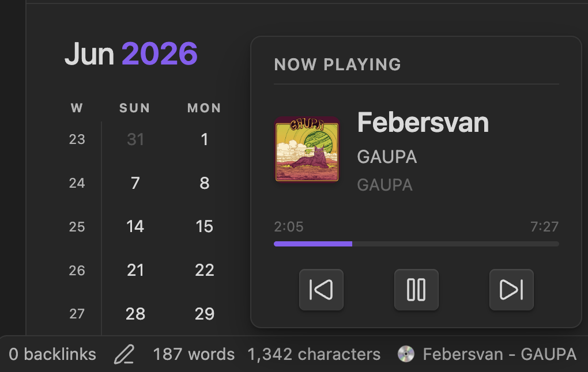

# Obsidian Mac Now Playing 🎵

A native macOS plugin for Obsidian that displays your currently playing song (from Spotify or Apple Music) directly in your status bar. 

Clicking the status bar item reveals a interactive popover with album art, a live progress bar, and media controls—all without needing complex API keys or developer accounts.

## Features

- **Zero Configuration:** Uses native macOS AppleScript. No Spotify Developer API keys, OAuth logins, or internet connections required. It just works.
- **Support for Players:** Choose between **Spotify** or **Apple Music** in the settings.
- **Interactive Popover:** Click the status bar to see:
  - Album Art (Spotify only)
  - Live track progress bar with timestamps
  - Play/Pause, Next, and Previous media controls
- **Customizable:**
  - Choose your status bar icon (Animated EQ Bars, Spinning Vinyl 💿, or Static Emoji 🎵).
  - Customize the display format (e.g., `{{title}} - {{artist}}`).
  - Choose your Status Bar Position (Far Left or Right).
  - Set a maximum title length to keep your status bar clean.
  - Automatically hide the plugin when music is paused.
  - Turn off the Album Art or Progress Bar for a minimalist popover.

## Screenshots


*The interactive popover featuring album art, live progress, and media controls.*

## Installation

### Option 1: Manual Installation (Before Official Release)
1. Download the latest release from the [Releases page](https://github.com/Hajorda/obsidian-mac-now-playing/releases).
2. Extract the `obsidian-mac-now-playing` folder.
3. Place the folder into your vault's plugin directory: `[YourVault]/.obsidian/plugins/`.
4. Open Obsidian, go to **Settings > Community plugins**, turn off "Safe mode", and enable **Mac Now Playing**.

### Option 2: Obsidian Community Plugins
Once approved by the Obsidian team, you will be able to search for "Mac Now Playing" directly in the Community Plugins browser inside Obsidian!

## Settings

You can configure the plugin in the Obsidian settings under "Mac Now Playing":
- **Media Player:** Switch between Spotify and Apple Music.
- **Refresh Interval:** Adjust how often the plugin polls for new songs (1-10 seconds).
- **Hide When Paused:** Keep your status bar tidy by hiding the track when no music is playing.
- **Show Album Art / Progress Bar:** Toggle the visual enhancements inside the popover.
- **Use Sliding Text:** Smoothly scrolls long track names inside the popover instead of cutting them off with `...`.
- **Status Bar Position:** Force the status bar item to sit on the far left side of the screen instead of the default right side.

## Development

If you want to contribute or build the plugin from source:

```bash
npm install
npm run build
```

## Author

Created by **Hajorda**.
